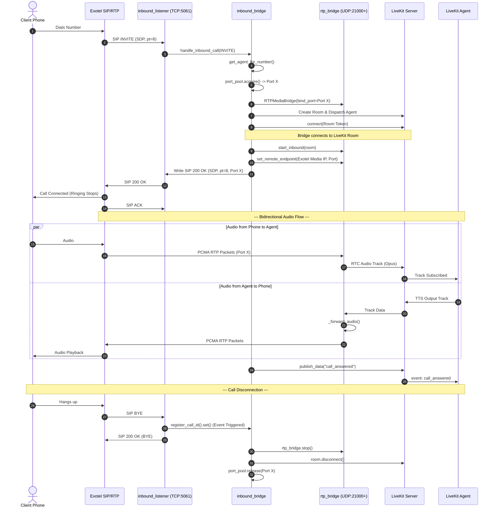
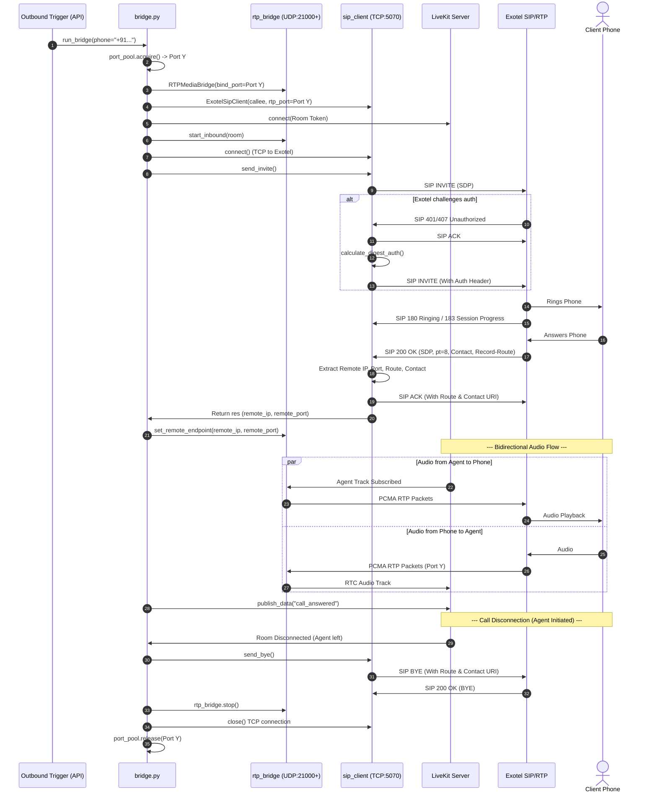

# SIP Architecture Diagram

This document presents the detailed architecture and sequence flow of the custom SIP bridge (`custom_sip_reach`) that connects Exotel SIP Trunks to LiveKit Agents. It outlines how both Inbound (Exotel → LiveKit) and Outbound (LiveKit → Exotel) calls are orchestrated.

## 1. System Components

### External Actors
- **Exotel SIP Proxy**: Handles PSTN routing and SIP signaling.
- **Exotel Media Server**: Handles RTP (audio) routing.
- **Client Phone**: The physical phone initiating or receiving the call.

### Internal Components (`custom_sip_reach`)
- **`inbound_listener`**: A persistent TCP server listening on port 5061 for inbound SIP messages (`INVITE`, `OPTIONS`, `BYE`) from Exotel.
- **`inbound_bridge`**: Orchestrates new inbound calls, establishes RTP ports, and creates LiveKit agent dispatches.
- **`sip_client (ExotelSipClient)`**: Handles outbound SIP signaling over TCP to Exotel (port 5070), including digest authentication.
- **`rtp_bridge (RTPMediaBridge)`**: An `aiortc` Datagram (UDP) server that receives PCMA/PCMU audio from Exotel and forwards it to LiveKit, and vice versa.
- **`port_pool`**: Manages a range of safe UDP ports for RTP allocation (avoiding LiveKit RTC port conflicts).
- **[bridge](file:///home/shubham_halder/CODE/lvk_agents/livekit_ai_website/backend/custom_sip_reach/bridge.py#42-191)**: The orchestrator for outbound calls.

### LiveKit Ecosystem
- **LiveKit Server (SFU)**: Manages WebRTC connections.
- **LiveKit Agent (`vyom_demos`)**: Python/Rust process analyzing audio and generating TTS responses.

---

## 2. Inbound Call Flow (Exotel → LiveKit)

This sequence illustrates the flow when a user dials the Exotel number.

---

## 3. Outbound Call Flow (LiveKit → Exotel)

This sequence illustrates the flow when the system dials out to a user.

## 4. Disconnection Strategies
The system implements robust fallback logic for call disconnection since SIP can be unreliable over WAN:

1. **SIP `BYE`**: Primary mechanism. The system watches the `inbound_listener` and the active outbound TCP socket.
2. **RTP Silence Threshold**: If `seconds_since_rx()` exceeds `RTP_SILENCE_TIMEOUT_SECONDS` (default: 30s) after audio has started flowing, the caller is assumed to be disconnected.
3. **No RTP After Answer**: If the call is answered but zero RTP packets arrive within `NO_RTP_AFTER_ANSWER_SECONDS` (default: 60s), the call is terminated.
4. **LiveKit Disconnect**: If the agent terminates the room from the WebRTC side, the bridge issues a SIP `BYE` and frees resources.
