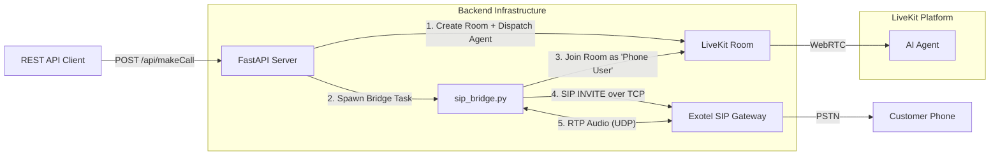

# Exotel SIP Bridge Architecture and Usage

## 1. Overview

This document details the custom SIP Bridge implementation for Exotel (`sip_bridge.py`)
used to make outbound calls through Exotel's SIP infrastructure and bridge them
into LiveKit rooms with AI agents.

LiveKit's built-in SIP service works natively with Twilio but does **not** support
Exotel due to specific signaling requirements (TCP transport, custom headers,
`nat=force_rport`). The SIP Bridge solves this by acting as a middleware that
handles Exotel SIP signaling and bridges the RTP audio into LiveKit rooms.

## 2. Architecture

### High-Level Flow



### Media Flow Detail

```
┌──────────────┐       ┌──────────────────┐       ┌──────────────┐
│  Phone User  │       │   RTPMediaBridge  │       │  LiveKit Room│
│  (via Exotel)│       │                  │       │  (AI Agent)  │
│              │       │                  │       │              │
│  Speaks ───────RTP──>│ G.711 PCMU 8kHz  │       │              │
│              │  UDP  │   ↓ decode       │       │              │
│              │       │ PCM 16-bit 8kHz  │       │              │
│              │       │   ↓ resample     │       │              │
│              │       │ PCM 16-bit 48kHz │       │              │
│              │       │   ↓ AudioFrame   │       │              │
│              │       │ AudioSource ─────────────>│ Agent hears  │
│              │       │ .capture_frame() │       │ user speech  │
│              │       │                  │       │              │
│              │       │                  │       │ Agent speaks │
│              │       │ AudioStream <────────────│ (TTS output) │
│  Hears ◄───────RTP──│   ↓ AudioFrame   │       │              │
│  Agent   │   UDP  │ PCM 48kHz        │       │              │
│              │       │   ↓ resample     │       │              │
│              │       │ PCM 8kHz         │       │              │
│              │       │   ↓ encode       │       │              │
│              │       │ G.711 PCMU       │       │              │
│              │       │   ↓ RTP packet   │       │              │
└──────────────┘       └──────────────────┘       └──────────────┘
```

### Components

1. **`outbound/outbound_call.py`** — The orchestrator:
   - Creates a LiveKit room with a unique name
   - Dispatches the AI agent to the room
   - When `call_from="exotel"`, spawns `sip_bridge.run_bridge()` as an async task
   - Passes the existing room name to the bridge (no duplicate rooms)

2. **`sip_bridge.py`** — The bridge, containing:
   - **`ExotelSipClient`**: Handles SIP signaling over TCP
     - Builds and sends SIP INVITE with SDP (offering PCMU only)
     - Handles 100 Trying, 180 Ringing, 200 OK responses
     - Parses remote SDP to extract RTP endpoint
     - Sends ACK and BYE
   - **`RTPMediaBridge`**: Handles bidirectional audio
     - Inbound: UDP → G.711 decode → resample 8k→48k → AudioFrame → AudioSource → LiveKit
     - Outbound: LiveKit AudioStream → resample 48k→8k → G.711 encode → RTP → UDP
   - **`run_bridge()`**: The main orchestrator function
     - Registers event handlers BEFORE connecting (prevents race conditions)
     - Joins the existing LiveKit room as a participant
     - Publishes a local audio track (phone user's voice)
     - Starts the SIP call
     - Bridges audio bidirectionally
     - Handles cleanup on disconnect

3. **`agent_session.py`** — The AI agent:
   - Detects bridge participants via metadata (`source: "exotel_bridge"`)
   - Applies the same audio readiness delay as native SIP participants
   - Sends welcome message after RTP stabilization

## 3. How to Trigger via API

### Endpoint

`POST /api/makeCall`

### Payload

```json
{
  "phone_number": "08697421450",
  "agent_type": "invoice",
  "call_from": "exotel"
}
```

- **`phone_number`**: The destination number
- **`agent_type`**: The ID of the agent (e.g., `invoice`, `restaurant`, `bank`)
- **`call_from`**: Set to `"exotel"` for the SIP bridge, `"twilio"` for native LiveKit SIP

### Response

```json
{
  "status": 0,
  "message": "SIP Bridge Initiated",
  "data": {
    "room": "invoice-outbound-1450-a1b2c3",
    "call_to_phone_number": "08697421450",
    "agent": "invoice",
    "method": "custom_bridge"
  }
}
```

## 4. Configuration

All Exotel-specific configuration is in `.env`:

```env
EXOTEL_SIP_HOST=pstn.in1.exotel.com
EXOTEL_SIP_PORT=5070
EXOTEL_CUSTOMER_IP=13.234.150.174
EXOTEL_CUSTOMER_SIP_PORT=5061
EXOTEL_MEDIA_IP=13.234.150.174
EXOTEL_CALLER_ID=08044319240
EXOTEL_FROM_DOMAIN=lokaviveka1m.sip.exotel.com
```

## 5. Supporting Multiple Agents

The system supports any agent defined in `AGENT_TYPES` map (in `agent_session.py`).

1. **Frontend/API** sends `agent_type` (e.g., `"bank"`)
2. **`outbound_call.py`** creates room `bank-outbound-XXXX-YYYYYY`
3. **`agent_session.py`** extracts `bank` from room name → initializes `BankingAgent`
4. **Bridge** joins the same room, starts SIP call, bridges audio

No additional configuration is needed per agent.

## 6. Technical Details

- **Signaling**: SIP INVITE/ACK/BYE over TCP to Exotel
- **Media**: G.711 PCMU (μ-law) at 8kHz ↔ PCM 16-bit at 48kHz for LiveKit
- **Resampling**: Uses `audioop.ratecv()` with persistent state for smooth audio
- **Codec**: Only PCMU offered in SDP (no ambiguity)
- **Binding**: UDP socket bound to `EXOTEL_MEDIA_IP` (the server's public IP)
- **Identity**: Bridge joins room as `sip-phone-{phone_number}` with metadata
  `{"source": "exotel_bridge", "phone": "...", "agent_type": "..."}`
- **Cleanup**: Sends SIP BYE, cancels async tasks, closes sockets on disconnect
